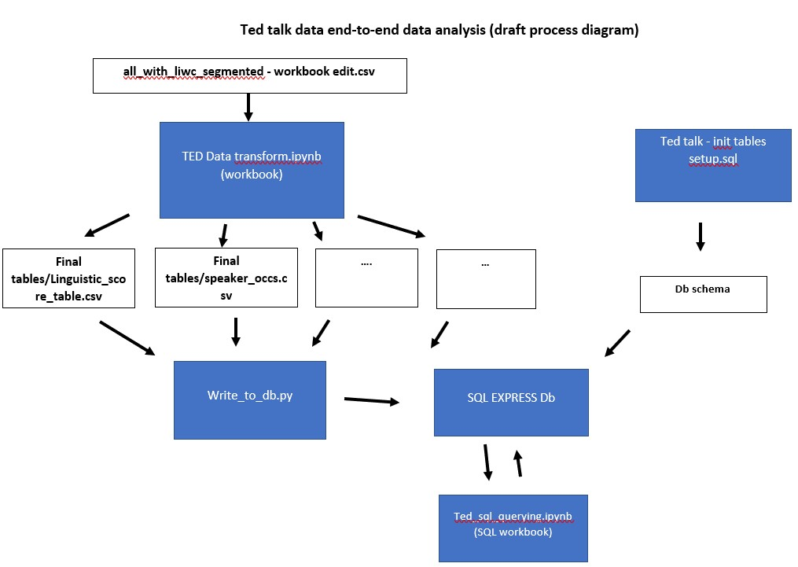

# Data-Science-project-end-to-end
Analysis on a Ted Talks  data set containing sentiment analysis results 

I plan to do an end to end project on this data set, the goal being experience across the data modelling/design, cleaning, querying/exploration and the final analysis

The early pipeline of the data is as below:

